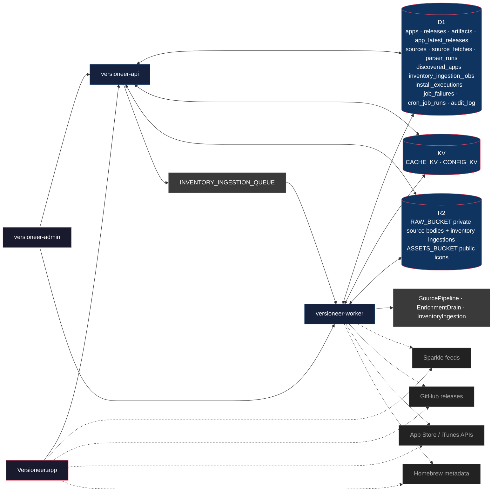

# Architecture

Versioneer ships as one desktop client plus three Cloudflare-backed services:

- `Versioneer.app`: scans local apps, runs local update-source checks, renders update/install UI, and talks to the API.
- `versioneer-api`: synchronous inventory decisions, install execution APIs, feedback/preflight endpoints, and durable inventory-ingestion handoff.
- `versioneer-worker`: scheduled source polling, queue consumption, enrichment, and durable workflows.
- `versioneer-admin`: the operational dashboard for review, sources, releases, jobs, failures, and app detail routes.

## System Boundaries

## Data Ownership

| Surface             | Responsibilities                                                                                                                                                                                                                                   |
| ------------------- | -------------------------------------------------------------------------------------------------------------------------------------------------------------------------------------------------------------------------------------------------- |
| `Versioneer.app`    | Local app scanning, local Sparkle/Electron/App Store/Homebrew checks, inventory submission, install execution reporting, cached scan results, and privileged/local install orchestration.                                                          |
| `versioneer-api`    | `POST /v1/inventory/check`, `POST /v1/install/executions`, `POST /v1/install/executions/:executionId/events`, preflight/feedback routes, discovered-app persistence, install-execution persistence, audit events, and inventory-ingestion enqueue. |
| `versioneer-worker` | Scheduled source polling, source parsing workflows, enrichment drain runs, inventory-ingestion queue claim/repair, and `InventoryIngestionWorkflow` execution.                                                                                     |
| `versioneer-admin`  | Review and operations UI, canonical jobs URLs (`/jobs/runs`, `/jobs/failures`), app detail child routes (`/apps/$appId`, `/aliases`, `/sources`, `/releases`), and worker RPC actions for retry/reparse/recompute flows.                           |

## Inventory Check And Ingestion

`POST /v1/inventory/check` is synchronous from the desktop client’s perspective:

1. The desktop submits installed apps plus `client.channels`.
2. The API validates the batch, returns nested inventory results, and reports invalid payloads via `issues.invalidApps`.
3. The API upserts unmatched apps into `discovered_apps`.
4. If there is post-response work to do, the API writes a private ingestion payload to `RAW_BUCKET` under `inventory-ingestions/YYYY/MM/DD/<ingestionId>.json`.
5. The API inserts an `inventory_ingestion_jobs` row with `pending` status and enqueues `{ ingestionId }` onto `INVENTORY_INGESTION_QUEUE`.
6. Queue failures are best-effort: the inventory response still succeeds, and failure state is recorded in `job_failures`.

The worker owns the asynchronous ingestion lifecycle:

- Queue claims move `pending` or retryable `failed` jobs to `queued`.
- Workflow instance IDs are deterministic: `<ingestionId>-<attempt>`.
- `InventoryIngestionWorkflow` loads the D1 row plus RAW_BUCKET payload, stores discovered/catalog icons, creates suggestions/evidence, resolves failures, and deletes the payload on success.
- Scheduled repair re-enqueues stale `pending` and retryable `failed` ingestions.

## Install Executions

Install reporting is a resource model, not a pair of ad hoc routes:

- `POST /v1/install/executions`
  - Validates the target release/artifact.
  - Persists immutable execution context: app/release/artifact, target architecture, selected channel, install strategy, execution route, and expected identity/version fields.
  - Returns `{ execution: { id, status: "prepared" } }`.

- `POST /v1/install/executions/:executionId/events`
  - Requires an existing execution row.
  - Accepts only `{ event, verification? }`.
  - Updates execution status to `started`, `succeeded`, `failed`, or `cancelled`.
  - Uses the stored execution context plus submitted verification to create audit entries, observability events, trust suggestions, and release discrepancy suggestions.

This means event submissions are true child resources and do not resend target/install/expected payloads.

## Source Pipeline

The worker’s scheduled and manual source operations share the same durable pipeline:

- Due sources are loaded from D1 using `nextPollAt` and source status.
- `SourcePipelineWorkflow` fetches source bodies, stores raw responses, runs the configured parser, upserts releases/artifacts/source fetches/parser runs, and recomputes `app_latest_releases`.
- Discovery enrichment runs separately for pending discovered apps.
- Homebrew cask sync remains a scheduled/manual worker concern rather than an API concern.

## Permanent Admin URL Contract

The current dashboard route structure is the release contract:

- `/jobs` redirects to `/jobs/runs`
- `/jobs/runs`
- `/jobs/failures`
- `/apps/$appId`
- `/apps/$appId/aliases`
- `/apps/$appId/sources`
- `/apps/$appId/releases`

These URLs should be treated as canonical in links, tests, docs, and support references.
