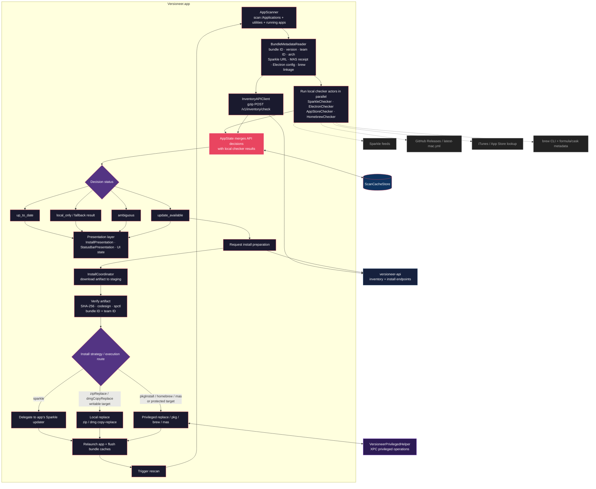
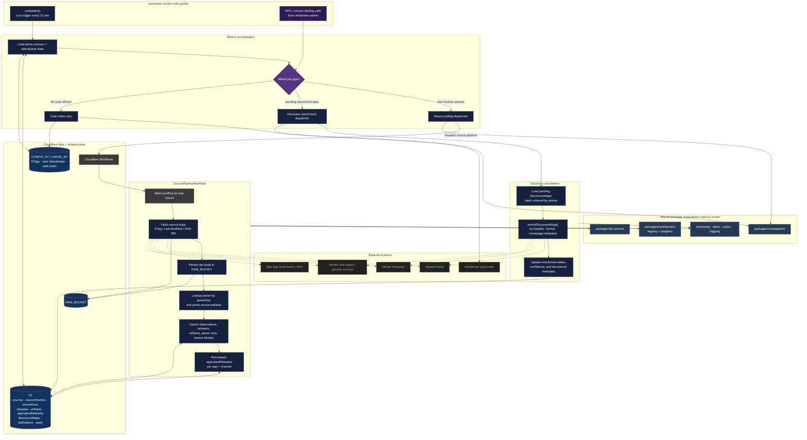

# Architecture

> [!WARNING]
> Most of the code in this repo was written by me, a human. These diagrams, however, were _very_ much not...

## App & service boundaries

```mermaid
flowchart TB
  %% Styles
  classDef client fill:#1a1a2e,stroke:#e94560,color:#fff
  classDef helper fill:#2d1b55,stroke:#9b5de5,color:#fff
  classDef service fill:#16213e,stroke:#0f3460,color:#fff
  classDef package fill:#243b53,stroke:#5c7cfa,color:#fff
  classDef store fill:#0f3460,stroke:#e94560,color:#fff
  classDef infra fill:#3a3a3a,stroke:#888,color:#fff
  classDef external fill:#222,stroke:#666,color:#aaa

  %% Desktop
  subgraph DESKTOP["Desktop application"]
    direction TB
    APP["Versioneer.app<br/>SwiftUI macOS app"]:::client
    HELPER["VersioneerPrivilegedHelper<br/>LaunchDaemon + XPC"]:::helper
  end

  %% Operations
  subgraph OPS["Operations"]
    direction TB
    ADMIN["versioneer-admin<br/>TanStack React Start SSR"]:::client
  end

  %% Backend
  subgraph SERVICES["Backend services"]
    direction LR
    API["versioneer-api<br/>Hono HTTP API<br/>/v1/* · /health"]:::service
    WORKER["versioneer-worker<br/>cron + Workflows"]:::service
  end

  %% Shared packages
  subgraph PACKAGES["Shared monorepo packages"]
    direction TB

    subgraph CORE["packages/core"]
      direction TB
      IDENTITY["identity<br/>alias matching + normalization"]:::package
      PARSERS["parsers<br/>registry + adapters"]:::package
      PIPELINE["pipeline<br/>fetch · parse · recompute · enrich"]:::package
      SUPPORT["versioning · validation · dates · cache · logging"]:::package
    end

    DBPKG["packages/db<br/>Drizzle schema definitions"]:::package
  end

  %% Data / infra
  subgraph DATA["Cloudflare data + infrastructure"]
    direction LR
    D1[("D1<br/>catalog · releases · sources · discovery<br/>trust assertions · installs · feedback · audit")]:::store
    R2[("R2<br/>RAW_BUCKET · ASSETS_BUCKET")]:::store
    KV[("KV<br/>CACHE_KV · CONFIG_KV")]:::store
    WF["Cloudflare Workflows<br/>SourcePipelineWorkflow"]:::infra
  end

  %% External
  subgraph EXTERNAL["External systems"]
    direction TB
    SPARKLE["Sparkle feeds"]:::external
    GITHUB["GitHub Releases"]:::external
    MAS["Mac App Store / iTunes API"]:::external
    BREW["Homebrew"]:::external
  end

  %% Desktop relationships
  APP -->|"scan inventory + submit metadata"| API
  APP -.->|"local checks:<br/>SparkleChecker · ElectronChecker<br/>AppStoreChecker · HomebrewChecker"| SPARKLE
  APP -.-> GITHUB
  APP -.-> MAS
  APP -.-> BREW
  APP <-->|"XPC for privileged install operations"| HELPER

  %% Operations relationships
  ADMIN -->|"admin API + auth-backed ops UI"| API
  ADMIN -->|"service binding RPC<br/>manual reparse / recompute / retry"| WORKER

  %% API internals
  API --> IDENTITY
  API --> SUPPORT
  API --> DBPKG
  API <--> D1
  API <--> KV

  %% Worker internals
  WORKER --> PARSERS
  WORKER --> PIPELINE
  WORKER --> SUPPORT
  WORKER --> DBPKG
  WORKER <--> D1
  WORKER <--> R2
  WORKER <--> KV
  WORKER --> WF

  %% Worker ingestion
  WORKER -.->|"poll + fetch + parse"| SPARKLE
  WORKER -.->|"poll + fetch + parse"| GITHUB
  WORKER -.->|"poll + fetch + parse"| MAS
  WORKER -.->|"cask index sync"| BREW
```

## Update decision → execution flows

## Catalog ingestion pipeline

