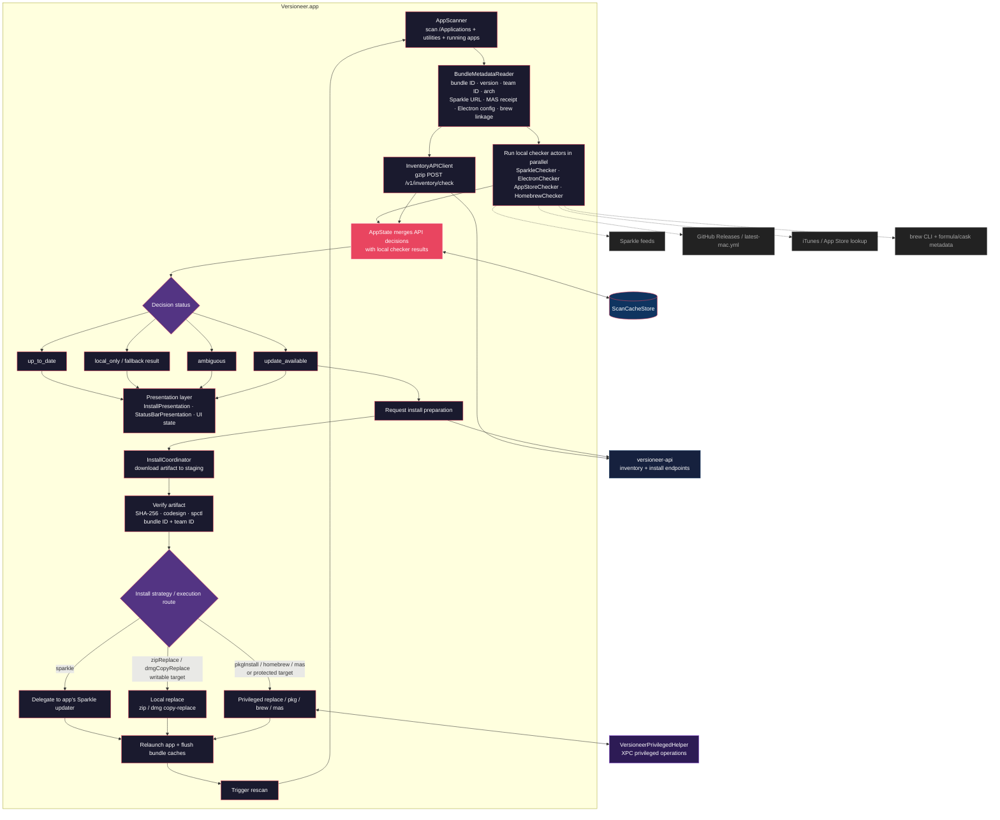
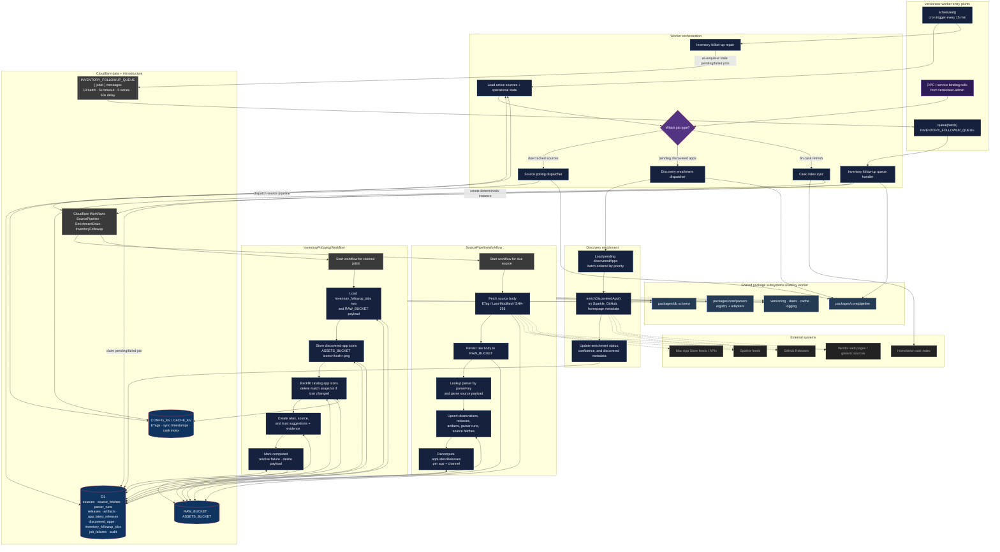

# Architecture

> [!WARNING]
> Most of the code in this repo was written by me, a human. These diagrams, however, were _very_ much not...

## App & service boundaries

```mermaid
flowchart TB
  %% Styles
  classDef client fill:#1a1a2e,stroke:#e94560,color:#fff
  classDef helper fill:#2d1b55,stroke:#9b5de5,color:#fff
  classDef service fill:#16213e,stroke:#0f3460,color:#fff
  classDef package fill:#243b53,stroke:#5c7cfa,color:#fff
  classDef store fill:#0f3460,stroke:#e94560,color:#fff
  classDef infra fill:#3a3a3a,stroke:#888,color:#fff
  classDef external fill:#222,stroke:#666,color:#aaa

  %% Desktop
  subgraph DESKTOP["Desktop application"]
    direction TB
    APP["Versioneer.app<br/>SwiftUI macOS app"]:::client
    HELPER["VersioneerPrivilegedHelper<br/>LaunchDaemon + XPC"]:::helper
  end

  %% Operations
  subgraph OPS["Operations"]
    direction TB
    ADMIN["versioneer-admin<br/>TanStack React Start SSR"]:::client
  end

  %% Backend
  subgraph SERVICES["Backend services"]
    direction LR
    API["versioneer-api<br/>Hono HTTP API<br/>/v1/* · /health"]:::service
    WORKER["versioneer-worker<br/>cron + queue consumer + Workflows"]:::service
  end

  %% Shared packages
  subgraph PACKAGES["Shared monorepo packages"]
    direction TB

    subgraph CORE["packages/core"]
      direction TB
      IDENTITY["identity<br/>alias matching + normalization"]:::package
      PARSERS["parsers<br/>registry + adapters"]:::package
      PIPELINE["pipeline<br/>fetch · parse · recompute · enrich"]:::package
      SUPPORT["versioning · validation · dates · cache · logging"]:::package
    end

    DBPKG["packages/db<br/>Drizzle schema definitions"]:::package
  end

  %% Data / infra
  subgraph DATA["Cloudflare data + infrastructure"]
    direction LR
    D1[("D1<br/>catalog · releases · sources · discovery<br/>inventory_followup_jobs · job_failures · audit")]:::store
    R2[("R2<br/>RAW_BUCKET private payloads/source bodies<br/>ASSETS_BUCKET public icons")]:::store
    KV[("KV<br/>CACHE_KV · CONFIG_KV")]:::store
    QUEUE["Cloudflare Queues<br/>INVENTORY_FOLLOWUP_QUEUE<br/>+ environment DLQ"]:::infra
    WF["Cloudflare Workflows<br/>SourcePipeline · EnrichmentDrain · InventoryFollowup"]:::infra
  end

  %% External
  subgraph EXTERNAL["External systems"]
    direction TB
    SPARKLE["Sparkle feeds"]:::external
    GITHUB["GitHub Releases"]:::external
    MAS["Mac App Store / iTunes API"]:::external
    BREW["Homebrew"]:::external
  end

  %% Desktop relationships
  APP -->|"scan inventory + submit metadata"| API
  APP -.->|"local checks:<br/>SparkleChecker · ElectronChecker<br/>AppStoreChecker · HomebrewChecker"| SPARKLE
  APP -.-> GITHUB
  APP -.-> MAS
  APP -.-> BREW
  APP <-->|"XPC for privileged install operations"| HELPER

  %% Operations relationships
  ADMIN -->|"admin API + auth-backed ops UI"| API
  ADMIN -->|"service binding RPC<br/>manual reparse / recompute / retry"| WORKER

  %% API internals
  API --> IDENTITY
  API --> SUPPORT
  API --> DBPKG
  API <--> D1
  API <--> KV
  API -->|"private inventory follow-up payloads"| R2
  API -->|"enqueue { jobId }"| QUEUE

  %% Worker internals
  WORKER --> PARSERS
  WORKER --> PIPELINE
  WORKER --> SUPPORT
  WORKER --> DBPKG
  WORKER <--> D1
  WORKER <--> R2
  WORKER <--> KV
  WORKER --> WF
  QUEUE -->|"consume follow-up messages"| WORKER
  WORKER -->|"repair stale pending/failed jobs"| QUEUE

  %% Worker ingestion
  WORKER -.->|"poll + fetch + parse"| SPARKLE
  WORKER -.->|"poll + fetch + parse"| GITHUB
  WORKER -.->|"poll + fetch + parse"| MAS
  WORKER -.->|"cask index sync"| BREW
```

## Cloudflare resource ownership

| Surface             | Cloudflare bindings / responsibilities                                                                                                                                                                                                                                     |
| ------------------- | -------------------------------------------------------------------------------------------------------------------------------------------------------------------------------------------------------------------------------------------------------------------------- |
| `versioneer-api`    | HTTP validation, inventory decisions, synchronous `discovered_apps` writes, `DB`, `CACHE_KV`, `CONFIG_KV`, `RAW_BUCKET`, and producer-only `INVENTORY_FOLLOWUP_QUEUE`. It does not write public icons.                                                                     |
| `versioneer-worker` | Scheduled source polling, service-binding RPC, queue consumption, `DB`, `RAW_BUCKET`, `ASSETS_BUCKET`, `CACHE_KV`, `CONFIG_KV`, producer + consumer `INVENTORY_FOLLOWUP_QUEUE`, and the `SOURCE_PIPELINE`, `ENRICHMENT_DRAIN`, and `INVENTORY_FOLLOWUP` Workflow bindings. |
| `versioneer-admin`  | Operational UI over the API plus service-binding RPC to `versioneer-worker`. The failure queue includes `inventory_followup` jobs and can ask the worker to re-enqueue them. Dashboard asset routes read from `ASSETS_BUCKET`.                                             |

`RAW_BUCKET` is for private durable inputs such as fetched source bodies and inventory follow-up payloads. `ASSETS_BUCKET` is for final public assets such as catalog and discovery icons.

## Update decision → execution flows

## Inventory follow-up handoff

`POST /v1/inventory/check` remains a synchronous inventory decision endpoint from the desktop client's perspective. The API still validates the scan, computes decisions, and persists `discovered_apps` before returning the response. Everything after that becomes a durable private handoff:

1. The API builds a compact follow-up payload containing only discovered-app icon candidates and matched catalog-app suggestion/icon candidates.
2. The payload is stored in `RAW_BUCKET` under `inventory-followups/YYYY/MM/DD/<jobId>.json`.
3. D1 records an `inventory_followup_jobs` row with `pending | queued | running | completed | failed`, `payloadR2Key`, `workflowInstanceId`, `attemptCount`, item counters, errors, and timestamps.
4. The queue message is only `{ jobId }`, keeping Cloudflare Queues payloads small and making D1/R2 the durable source of truth.
5. If enqueue fails after the D1 row is written, the desktop response still returns, the job stays `pending`, and `job_failures` records `inventory_followup` with the `enqueue` key.
6. The worker queue handler claims `pending` or retryable `failed` jobs, increments the attempt count, creates deterministic Workflow instance IDs as `<jobId>-<attempt>`, and acks the message only after Workflow creation succeeds. Completed, queued, and running jobs are acked as duplicate-safe no-ops.
7. The scheduled worker repairs stale `pending` or retryable `failed` jobs by re-enqueuing them. Queue, handoff, repair, and Workflow failures are recorded in `job_failures` as `inventory_followup`.

`InventoryFollowupWorkflow` owns the async work that used to live behind the API route: icon storage, catalog icon backfill, inventory-match snapshot invalidation, alias/source/trust suggestions, and suggestion evidence. Successful runs mark the D1 job completed, resolve related failures, and delete the private R2 payload. Failed runs mark the job failed and keep the payload for retry/debugging.

## Catalog ingestion and follow-up pipeline

